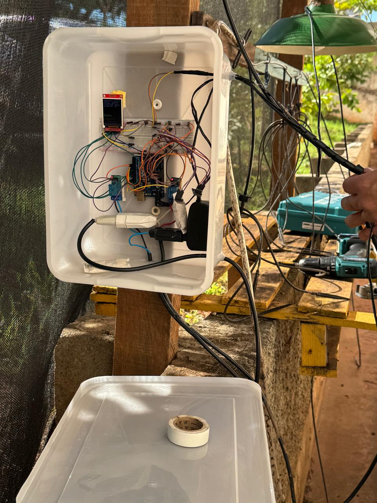
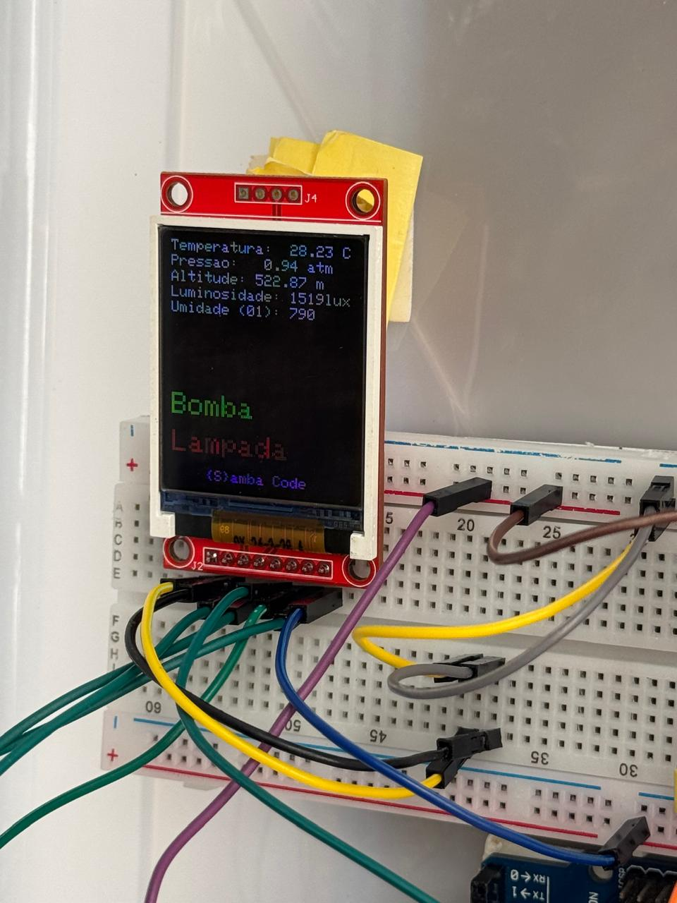
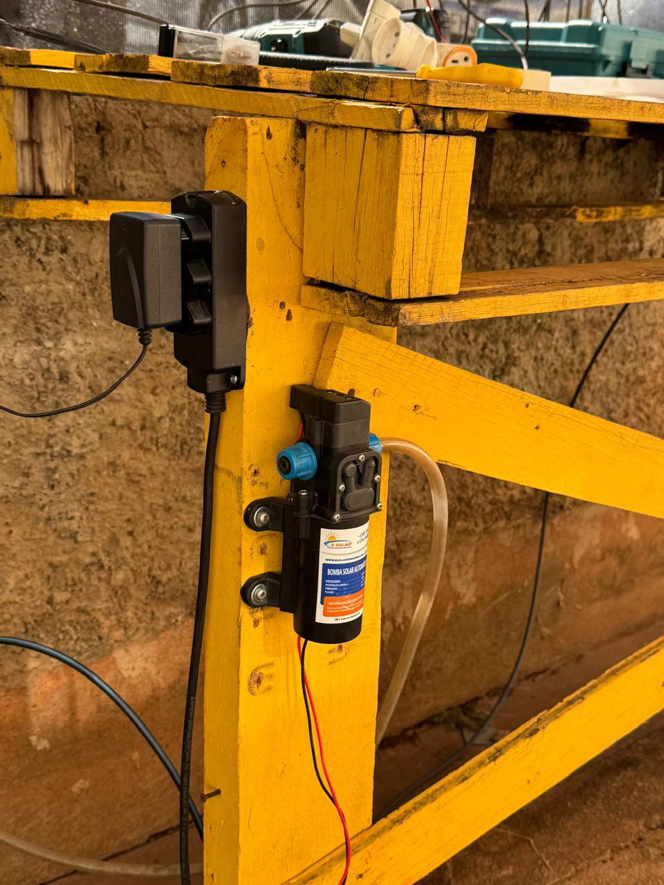
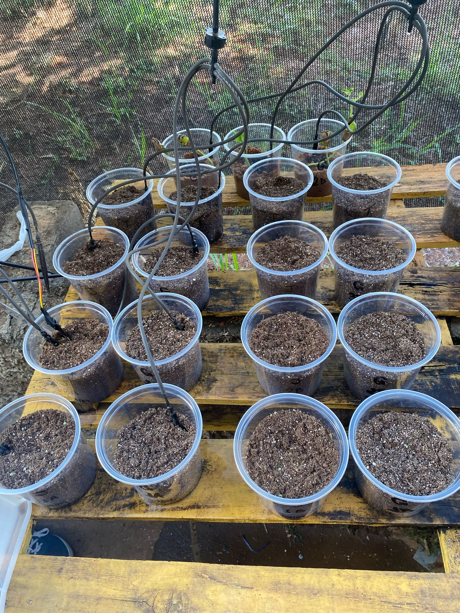

# 🌿 Ecology

**Ecology** é um sistema completo de monitoramento ambiental que coleta dados em tempo real de sensores físicos (como umidade, temperatura, luminosidade e pressão), processa essas informações via backend e exibe estatísticas em tempo real em um painel visual no frontend.  
Ideal para automação de cuidados com plantas, análise ambiental e visualização de dados com foco em decisões inteligentes.

---

## 🚀 Tecnologias Utilizadas

- **Arduino** – Coleta de dados dos sensores
- **Python** – Comunicação Bluetooth e envio de dados
- **Nest.js (TypeScript)** – Backend (API + WebSocket)
- **Next.js (TypeScript)** – Frontend com painel de estatísticas
- **PostgreSQL + Docker** – Armazenamento e persistência dos dados
- **Nginx** - Proxy reverso

---

## 🛠️ Instalação para Desenvolvimento

### ✅ Pré-requisitos

Certifique-se de ter as seguintes dependências instaladas:

- [Node.js](https://nodejs.org)
- [PNPM](https://pnpm.io)
- [Docker](https://www.docker.com/)

---

### 🛠️ Configurações de Sistema

Adicione as seguintes entradas no arquivo `/etc/hosts` (Linux) para simular os domínios locais:

```bash
127.0.0.1   ecology.local
127.0.0.1   api.ecology.local
127.0.0.1   pgadmin.ecology.local
```

> 💡 No Windows, o arquivo `hosts` está localizado em:  
> `C:\Windows\System32\drivers\etc\hosts`

---

### 🌿 Inicialização do Projeto

- No Linux, execute:

```bash
./up.sh
```

- No Windows, execute:

```cmd
up.bat
```

Isso iniciará os containers, backend, frontend e banco de dados.

---

### ✅ Acesso

Se tudo ocorrer corretamente, o sistema estará disponível nos seguintes endereços:

- 🌐 **Frontend**: [http://ecology.local](http://ecology.local)
- 🔧 **Backend (API)**: [http://api.ecology.local](http://api.ecology.local)
- 🐘 **PgAdmin**: [http://pgadmin.ecology.local](http://pgadmin.ecology.local)

---

### 🔌 Circuito Físico

Aqui está o circuito físico utilizado no projeto:

> O circuito inclui sensores de temperatura, umidade, luminosidade e pressão conectados ao Arduino, com comunicação via Bluetooth para o backend Python.






---

## 📄 Licença

Este projeto é licenciado sob a [GNU GPL](LICENSE).

---

🚀 Desenvolvido por **[Frooszy](https://github.com/Frooszy)**  
